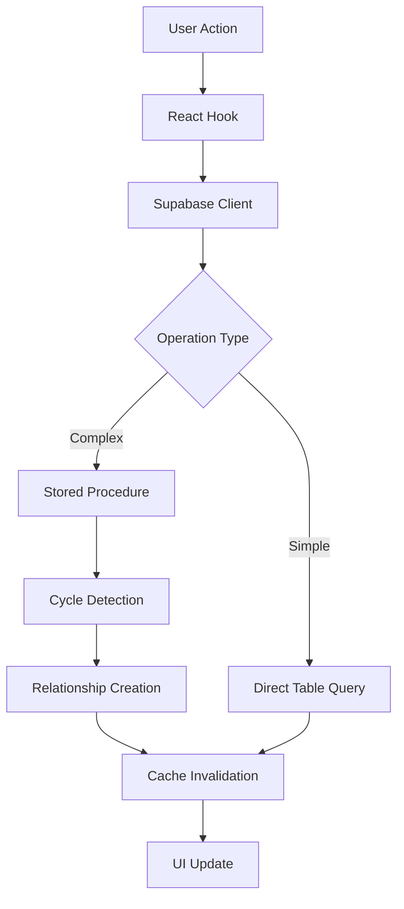

# Traceability MCP Tool Implementation Guide

## Executive Summary

This document provides a comprehensive analysis of the current traceability implementation in the Atoms platform and detailed specifications for creating a Model Context Protocol (MCP) tool. The traceability system uses a dual-table architecture with sophisticated stored procedures, real-time UI components, and multi-tenant organization scoping.

## Current Implementation Architecture

### Database Layer Analysis

#### Core Tables Structure

**1. `trace_links` Table - Flexible Relationship Management**
```sql
-- Primary table for general traceability relationships
CREATE TABLE trace_links (
    id UUID PRIMARY KEY DEFAULT gen_random_uuid(),
    source_id UUID NOT NULL,              -- Source entity ID
    source_type entity_type NOT NULL,     -- 'requirement' | 'document'
    target_id UUID NOT NULL,              -- Target entity ID
    target_type entity_type NOT NULL,     -- 'requirement' | 'document'
    link_type trace_link_type NOT NULL,   -- Relationship type
    description TEXT,                     -- Optional description
    created_at TIMESTAMP DEFAULT NOW(),
    created_by UUID REFERENCES profiles(id),
    updated_at TIMESTAMP,
    updated_by UUID REFERENCES profiles(id),
    deleted_at TIMESTAMP,
    deleted_by UUID REFERENCES profiles(id),
    is_deleted BOOLEAN DEFAULT FALSE,
    version INTEGER DEFAULT 1
);
```

**2. `requirements_closure` Table - Optimized Hierarchy**
```sql
-- Closure table for efficient parent-child hierarchy operations
CREATE TABLE requirements_closure (
    ancestor_id UUID NOT NULL REFERENCES requirements(id) ON DELETE CASCADE,
    descendant_id UUID NOT NULL REFERENCES requirements(id) ON DELETE CASCADE,
    depth INTEGER NOT NULL,              -- 0=self, 1=direct, 2=grandparent, etc.
    created_at TIMESTAMP DEFAULT NOW(),
    created_by UUID NOT NULL REFERENCES profiles(id),
    updated_at TIMESTAMP,
    updated_by UUID REFERENCES profiles(id),
    PRIMARY KEY (ancestor_id, descendant_id)
);
```

#### Key Stored Procedures

**1. Cycle Detection Function**
```sql
-- Returns TRUE if creating relationship would cause cycle
CREATE OR REPLACE FUNCTION check_requirement_cycle(
    p_ancestor_id UUID,
    p_descendant_id UUID
) RETURNS BOOLEAN
```

**2. Relationship Management Functions**
```sql
-- Create relationship with validation and cascade
CREATE OR REPLACE FUNCTION create_requirement_relationship(
    p_ancestor_id UUID,
    p_descendant_id UUID,
    p_created_by UUID
) RETURNS TABLE (
    success BOOLEAN,
    error_code TEXT,
    message TEXT,
    relationships_created INTEGER
)

-- Delete relationship and clean up cascades
CREATE OR REPLACE FUNCTION delete_requirement_relationship(
    p_ancestor_id UUID,
    p_descendant_id UUID,
    p_updated_by UUID
) RETURNS TABLE (
    success BOOLEAN,
    error_code TEXT,
    message TEXT,
    relationships_deleted INTEGER
)
```

**3. Query Functions**
```sql
-- Get hierarchical descendants
CREATE OR REPLACE FUNCTION get_requirement_descendants(
    p_ancestor_id UUID,
    p_max_depth INTEGER DEFAULT NULL
) RETURNS TABLE (
    requirement_id UUID,
    title TEXT,
    depth INTEGER,
    direct_parent BOOLEAN
)

-- Get hierarchical ancestors
CREATE OR REPLACE FUNCTION get_requirement_ancestors(
    p_descendant_id UUID,
    p_max_depth INTEGER DEFAULT NULL
) RETURNS TABLE (
    requirement_id UUID,
    title TEXT,
    depth INTEGER,
    direct_parent BOOLEAN
)

-- Get complete tree structure
CREATE OR REPLACE FUNCTION get_requirement_tree(
    p_project_id UUID DEFAULT NULL
) RETURNS TABLE (
    requirement_id UUID,
    title TEXT,
    parent_id UUID,
    depth INTEGER,
    path TEXT,
    has_children BOOLEAN
)
```

#### Performance Optimizations

**Indexes for Optimal Query Performance**
```sql
-- Trace links indexes
CREATE INDEX idx_trace_links_source ON trace_links(source_id, source_type);
CREATE INDEX idx_trace_links_target ON trace_links(target_id, target_type);
CREATE INDEX idx_trace_links_type ON trace_links(link_type);
CREATE INDEX idx_trace_links_deleted ON trace_links(is_deleted, created_at);

-- Closure table indexes
CREATE INDEX idx_requirements_closure_ancestor ON requirements_closure(ancestor_id);
CREATE INDEX idx_requirements_closure_descendant ON requirements_closure(descendant_id);
CREATE INDEX idx_requirements_closure_depth ON requirements_closure(depth);
CREATE INDEX idx_requirements_closure_ancestor_depth ON requirements_closure(ancestor_id, depth);
```

### API Layer Analysis

#### Current Hook Structure

**Query Hooks**
```typescript
// Fetch outgoing trace links (current requirement as source)
useTraceLinks(sourceId: string, sourceType: EEntityType, queryFilters?: QueryFilters)

// Fetch incoming trace links (current requirement as target)
useReverseTraceLinks(targetId: string, targetType: EEntityType, queryFilters?: QueryFilters)

// Fetch requirements by multiple IDs
useRequirementsByIds(requirementIds: string[])

// Project-scoped requirements (supports cross-document linking)
useProjectRequirements(projectId: string, options?: { enabled?: boolean })

// Organization projects for scope selection
useOrganizationProjects(organizationId: string)

// Hierarchical requirement tree
useRequirementTree(projectId?: string)
```

**Mutation Hooks**
```typescript
// Single relationship creation
useCreateTraceLink()

// Bulk relationship creation
useCreateTraceLinks()

// Relationship deletion (soft delete)
useDeleteTraceLink()

// Hierarchical relationship operations
useCreateRelationship()
useDeleteRelationship()
```

#### Data Flow Pattern



### Organization and Project Targeting

#### Multi-Tenant Architecture

**Hierarchy Structure**
```
Organization (UUID)
├── Projects (UUID[])
│   ├── Documents (UUID[])
│   │   └── Requirements (UUID[])
│   └── Cross-Document Traceability
└── Access Control (RLS Policies)
```

**Current Scoping Implementation**
```typescript
// Organization-level project fetching
const { data: projects } = useOrganizationProjects(orgId);

// Project-level requirement fetching (spans all documents)
const { data: requirements } = useProjectRequirements(projectId);

// Document-level requirement fetching (single document)
const { data: docRequirements } = useDocumentRequirements(documentId);
```

#### Access Control Patterns

**Row Level Security (RLS)**
- All tables implement organization-based isolation
- Users can only access data within their organization
- Project-level permissions control requirement visibility
- Document-level permissions control detailed access

## MCP Tool Design Specifications

### Core Tool Functions

#### 1. Create Trace Relationship

**Function Signature**
```typescript
async function createTraceRelationship(params: {
    orgId: string;                          // Required: Organization scope
    sourceRequirementId: string;            // Source requirement UUID
    targetRequirementId: string;            // Target requirement UUID
    relationshipType: 'parent_of' | 'child_of' | 'relates_to' | 'depends_on' | 'conflicts_with';
    description?: string;                   // Optional relationship description
    userId: string;                         // User creating the relationship
    validateCycle?: boolean;                // Default: true
}) Promise<{
    success: boolean;
    relationshipId?: string;
    error?: string;
    errorCode?: 'CYCLE_DETECTED' | 'INVALID_SCOPE' | 'PERMISSION_DENIED' | 'NOT_FOUND';
    relationshipsCreated?: number;          // For hierarchy operations
}>
```

**Implementation Flow**
1. Validate organization scope and user permissions
2. Verify both requirements exist and are accessible
3. Check for existing relationships (prevent duplicates)
4. Run cycle detection if applicable
5. Create relationship record(s)
6. Return structured result

#### 2. Bulk Create Relationships

**Function Signature**
```typescript
async function bulkCreateRelationships(params: {
    orgId: string;
    parentRequirementId: string;
    childRequirementIds: string[];
    description?: string;
    userId: string;
    validateCycles?: boolean;               // Default: true
    continueOnError?: boolean;              // Default: false
}) Promise<{
    success: boolean;
    totalRequested: number;
    totalCreated: number;
    totalSkipped: number;
    results: Array<{
        childId: string;
        success: boolean;
        error?: string;
        errorCode?: string;
    }>;
    error?: string;
}>
```

**Use Cases**
- Batch parent-child relationship creation
- Importing traceability matrices
- Workflow automation scenarios

#### 3. Query Requirement Hierarchy

**Function Signature**
```typescript
async function queryRequirementHierarchy(params: {
    orgId: string;
    requirementId: string;
    direction: 'ancestors' | 'descendants' | 'both';
    maxDepth?: number;                      // Default: 10
    includeMetadata?: boolean;              // Include descriptions, timestamps
    format?: 'flat' | 'tree' | 'graph';   // Output format
}) Promise<{
    success: boolean;
    requirement: {
        id: string;
        name: string;
        externalId?: string;
        description?: string;
    };
    relationships: Array<{
        id: string;
        name: string;
        externalId?: string;
        description?: string;
        relationshipType: string;
        depth: number;
        path?: string;                      // For tree format
        hasChildren?: boolean;
    }>;
    metadata?: {
        totalCount: number;
        maxDepthReached: boolean;
        queryTimeMs: number;
    };
    error?: string;
}>
```

#### 4. Search Requirements for Linking

**Function Signature**
```typescript
async function searchRequirementsForLinking(params: {
    orgId: string;
    projectId?: string;                     // Scope to project (recommended)
    documentId?: string;                    // Scope to document
    excludeRequirementId?: string;          // Exclude current requirement
    searchQuery?: string;                   // Text search in name/description
    requirementType?: string;               // Filter by requirement type
    status?: string[];                      // Filter by status
    excludeExistingLinks?: boolean;         // Default: true
    maxResults?: number;                    // Default: 100
    offset?: number;                        // For pagination
}) Promise<{
    success: boolean;
    requirements: Array<{
        id: string;
        name: string;
        externalId?: string;
        description?: string;
        documentName: string;
        projectName: string;
        status: string;
        type: string;
        canLink: boolean;                   // Based on scope and permissions
        existingRelationship?: string;      // If already linked
    }>;
    pagination: {
        total: number;
        offset: number;
        limit: number;
        hasMore: boolean;
    };
    error?: string;
}>
```

#### 5. Validate Relationship Cycle

**Function Signature**
```typescript
async function validateRelationshipCycle(params: {
    orgId: string;
    ancestorId: string;
    descendantId: string;
    maxDepth?: number;                      // Default: 100
}) Promise<{
    success: boolean;
    wouldCreateCycle: boolean;
    cyclePath?: Array<{
        requirementId: string;
        name: string;
        externalId?: string;
    }>;
    error?: string;
}>
```

#### 6. Generate Traceability Matrix

**Function Signature**
```typescript
async function generateTraceabilityMatrix(params: {
    orgId: string;
    projectId: string;
    includeDocuments?: boolean;
    relationshipTypes?: string[];           // Filter specific relationship types
    format?: 'json' | 'csv' | 'excel';
    includeOrphans?: boolean;               // Include requirements with no links
}) Promise<{
    success: boolean;
    matrix: {
        requirements: Array<{
            id: string;
            name: string;
            externalId?: string;
            documentName: string;
            parentCount: number;
            childCount: number;
            totalLinks: number;
        }>;
        relationships: Array<{
            sourceId: string;
            targetId: string;
            type: string;
            description?: string;
        }>;
        statistics: {
            totalRequirements: number;
            totalRelationships: number;
            orphanRequirements: number;
            coveragePercentage: number;
        };
    };
    exportUrl?: string;                     // For file formats
    error?: string;
}>
```

### Error Handling and Validation

#### Structured Error Codes

```typescript
enum TraceabilityErrorCode {
    // Validation Errors
    INVALID_UUID = 'INVALID_UUID',
    MISSING_REQUIRED_PARAM = 'MISSING_REQUIRED_PARAM',
    INVALID_RELATIONSHIP_TYPE = 'INVALID_RELATIONSHIP_TYPE',

    // Permission Errors
    ORGANIZATION_ACCESS_DENIED = 'ORGANIZATION_ACCESS_DENIED',
    PROJECT_ACCESS_DENIED = 'PROJECT_ACCESS_DENIED',
    REQUIREMENT_ACCESS_DENIED = 'REQUIREMENT_ACCESS_DENIED',

    // Business Logic Errors
    CYCLE_DETECTED = 'CYCLE_DETECTED',
    RELATIONSHIP_EXISTS = 'RELATIONSHIP_EXISTS',
    SELF_REFERENCE_NOT_ALLOWED = 'SELF_REFERENCE_NOT_ALLOWED',
    CROSS_PROJECT_NOT_ALLOWED = 'CROSS_PROJECT_NOT_ALLOWED',

    // Database Errors
    REQUIREMENT_NOT_FOUND = 'REQUIREMENT_NOT_FOUND',
    RELATIONSHIP_NOT_FOUND = 'RELATIONSHIP_NOT_FOUND',
    DATABASE_ERROR = 'DATABASE_ERROR',
    CONCURRENT_MODIFICATION = 'CONCURRENT_MODIFICATION',

    // Rate Limiting
    RATE_LIMIT_EXCEEDED = 'RATE_LIMIT_EXCEEDED',
    BULK_OPERATION_TOO_LARGE = 'BULK_OPERATION_TOO_LARGE'
}
```

#### Validation Framework

```typescript
class TraceabilityValidator {
    static validateOrgAccess(orgId: string, userId: string): Promise<boolean>
    static validateRequirementExists(reqId: string, orgId: string): Promise<boolean>
    static validateRequirementScope(reqId: string, projectId?: string): Promise<boolean>
    static validateRelationshipType(type: string): boolean
    static validateBulkOperationSize(items: any[], maxSize: number): boolean
    static sanitizeSearchQuery(query: string): string
}
```

### Performance Considerations

#### Caching Strategy

**1. Redis Caching for Frequent Queries**
```typescript
interface CacheConfig {
    requirementDetails: { ttl: 300 };       // 5 minutes
    hierarchyQueries: { ttl: 600 };         // 10 minutes
    projectRequirements: { ttl: 900 };      // 15 minutes
    organizationProjects: { ttl: 1800 };    // 30 minutes
}
```

**2. Query Optimization**
```sql
-- Use partial indexes for active relationships
CREATE INDEX idx_trace_links_active
ON trace_links(source_id, target_id, link_type)
WHERE is_deleted = FALSE;

-- Optimize closure table queries with depth limits
CREATE INDEX idx_closure_shallow
ON requirements_closure(ancestor_id, descendant_id)
WHERE depth <= 5;
```

#### Rate Limiting

```typescript
const rateLimits = {
    createRelationship: { requests: 100, window: 3600 },    // 100/hour
    bulkOperations: { requests: 10, window: 3600 },         // 10/hour
    searchRequirements: { requests: 1000, window: 3600 },   // 1000/hour
    hierarchyQueries: { requests: 200, window: 3600 }       // 200/hour
};
```

### Security and Access Control

#### Multi-Tenant Isolation

```sql
-- Row Level Security policies ensure organization isolation
CREATE POLICY "Users can only access their organization's requirements"
ON requirements FOR ALL
USING (
    EXISTS (
        SELECT 1 FROM documents d
        JOIN projects p ON d.project_id = p.id
        WHERE d.id = requirements.document_id
        AND p.organization_id = auth.jwt() ->> 'organization_id'
    )
);
```

#### Permission Validation

```typescript
interface PermissionCheck {
    canViewRequirement(reqId: string, userId: string): Promise<boolean>;
    canModifyRequirement(reqId: string, userId: string): Promise<boolean>;
    canCreateRelationships(projectId: string, userId: string): Promise<boolean>;
    canDeleteRelationships(projectId: string, userId: string): Promise<boolean>;
}
```

### Workflow Automation Opportunities

#### 1. Auto-Linking Rules

```typescript
interface AutoLinkRule {
    id: string;
    name: string;
    organizationId: string;
    projectId?: string;
    conditions: {
        sourcePattern?: RegExp;              // Match requirement names/IDs
        targetPattern?: RegExp;
        documentRelationship?: 'same' | 'sequential' | 'parent-child';
        statusMatch?: string[];
        typeMatch?: string[];
    };
    action: {
        relationshipType: string;
        autoDescription?: string;
        requireApproval?: boolean;
    };
    active: boolean;
}
```

#### 2. Compliance Reporting

```typescript
async function generateComplianceReport(params: {
    orgId: string;
    projectId: string;
    standard: 'ISO-26262' | 'DO-178C' | 'IEC-61508' | 'custom';
    includeGaps?: boolean;
    format?: 'json' | 'pdf' | 'excel';
}) Promise<{
    success: boolean;
    report: {
        coverageMetrics: {
            totalRequirements: number;
            tracedRequirements: number;
            coveragePercentage: number;
            orphanRequirements: string[];
        };
        traceabilityMatrix: Array<{
            level: string;
            requirements: number;
            traced: number;
            coverage: number;
        }>;
        gaps: Array<{
            requirementId: string;
            name: string;
            missingLinks: string[];
            severity: 'high' | 'medium' | 'low';
        }>;
    };
    exportUrl?: string;
}>
```

#### 3. Import/Export Workflows

```typescript
async function importTraceabilityMatrix(params: {
    orgId: string;
    projectId: string;
    source: 'csv' | 'excel' | 'jama' | 'doors';
    fileUrl: string;
    mapping: {
        sourceIdColumn: string;
        targetIdColumn: string;
        relationshipTypeColumn: string;
        descriptionColumn?: string;
    };
    dryRun?: boolean;                       // Validate without creating
    overwriteExisting?: boolean;
}) Promise<{
    success: boolean;
    preview: {
        totalRows: number;
        validRows: number;
        errors: Array<{
            row: number;
            error: string;
            data: any;
        }>;
        wouldCreate: number;
        wouldSkip: number;
    };
    importId?: string;                      // For actual import execution
}>
```

## Implementation Checklist

### Phase 1: Core MCP Tool Functions
- [ ] Implement `createTraceRelationship()` with full validation
- [ ] Implement `bulkCreateRelationships()` with error handling
- [ ] Implement `queryRequirementHierarchy()` with caching
- [ ] Implement `searchRequirementsForLinking()` with pagination
- [ ] Add comprehensive error handling and logging

### Phase 2: Advanced Features
- [ ] Implement `validateRelationshipCycle()` for pre-validation
- [ ] Implement `generateTraceabilityMatrix()` for reporting
- [ ] Add auto-linking rule engine
- [ ] Add compliance reporting templates

### Phase 3: Integration and Optimization
- [ ] Integrate with existing React Query cache invalidation
- [ ] Add Redis caching for performance
- [ ] Implement rate limiting and monitoring
- [ ] Add comprehensive test coverage

### Phase 4: Workflow Automation
- [ ] Implement import/export workflows
- [ ] Add webhook integration for external tools
- [ ] Create workflow templates for common patterns
- [ ] Add audit logging and compliance features

## Testing Strategy

### Unit Tests
- Database function validation (cycle detection, relationship creation)
- MCP tool parameter validation
- Error handling scenarios
- Permission checking logic

### Integration Tests
- End-to-end relationship creation workflows
- Bulk operation performance and rollback
- Cache invalidation and consistency
- Cross-project linking scenarios

### Performance Tests
- Large hierarchy traversal (>1000 nodes)
- Bulk relationship creation (>100 relationships)
- Concurrent modification scenarios
- Cache hit/miss ratios

### Security Tests
- Organization isolation verification
- Permission boundary testing
- SQL injection prevention
- Rate limiting effectiveness

---

## Conclusion

The current traceability implementation provides a solid foundation for creating a powerful MCP tool. The dual-table architecture, comprehensive stored procedures, and multi-tenant design enable sophisticated automation capabilities while maintaining performance and security.

The proposed MCP tool design leverages these strengths while adding powerful workflow automation, compliance reporting, and integration capabilities that will significantly enhance the platform's traceability features.